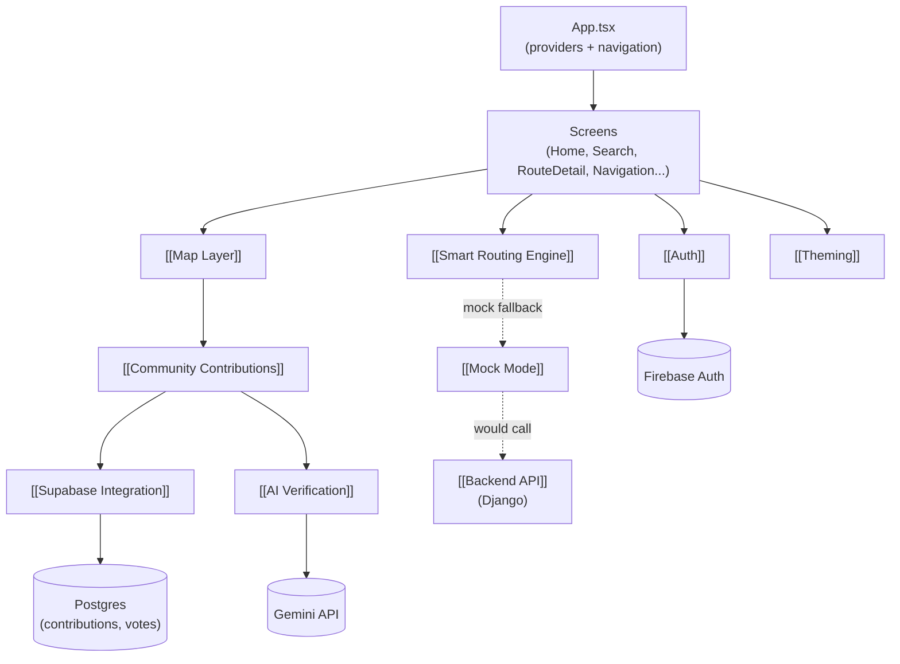

# WakaWay Architecture

> For current session state — what's finished, what's next, what's blocked — see [[Active Context]]. Important decisions made during development are recorded in `decisions/`, one file per decision, each linking why it was made and which files it touched.

WakaWay is a React Native (Expo + TypeScript) mobile app that helps people navigate informal transport in Lagos, Nigeria — danfo buses, keke tricycles, okada motorbikes, BRT, rail, ferry, and walking. There is no transit API for informal Nigerian transport, so routing is computed **client-side** by a custom engine rather than fetched from a server.

The system has three moving parts that don't fully overlap in responsibility yet: the **client app** does almost all of the real work (routing, UI, navigation), **Supabase** provides realtime community data (auth is actually Firebase, not Supabase), and the **Django backend** exists but is mostly unused — most of its endpoints are shadowed by [[Mock Mode]].

## At a glance

## Main components

### Client app shell
`client/src/App.tsx` wires up the provider stack — `ErrorBoundary` → `SafeAreaProvider` → `GestureHandlerRootView` → `AuthProvider` → `ThemeProvider` → `ToastProvider` → navigator — then branches between the authenticated app and the `AuthStack` based on Firebase auth state. See [[Navigation & Screens]] for the full screen list and [[Auth]] for how the authenticated/unauthenticated branch is decided.

### Routing
The [[Smart Routing Engine]] (`smartRoutingService.ts`) is the core of the product: Haversine-distance based multimodal route building over a hand-curated dataset of Lagos BRT corridors, rail lines, and danfo hubs, with a 2025 fare model and Lagos-Pidgin instructions. It's what `HomeScreen` and `RouteDetailScreen` actually call, independent of whether [[Mock Mode]] or the real [[Backend API]] is active.

### Map & live community data
The [[Map Layer]] (`MapView`, `CommunityMapView`, `AlertMarkers`) renders routes and reports on `react-native-maps`. Live data comes from [[Community Contributions]] — a realtime Supabase table of crowdsourced traffic/hazard/security alerts with a confirm/dismiss voting system, surfaced via `LiveAlertsFeed` and reported via `QuickReportBar`. Contribution legitimacy is optionally scored by [[AI Verification]] (Gemini).

### Backend & data layer
Two backends exist side by side:
- [[Supabase Integration]] — Postgres + realtime + RLS + edge functions, backing contributions/votes/AI scoring. This is live and required.
- [[Backend API]] — Django REST Framework, models the "proper" transit domain (stops, corridors, fares, reports) but most client calls to it are currently short-circuited by [[Mock Mode]].

### Cross-cutting concerns
- [[Auth]] — Firebase email/password + Nigerian phone OTP, not Supabase auth.
- [[Theming]] — WakaWay's day/night design system (`WW_LIGHT`/`WW_DARK`), auto-switches 7pm–6am Lagos time.
- [[Mock Mode]] — `USE_MOCK_DATA` flag in `client/src/utils/constants.ts`; determines whether `api.ts` hits Django or returns canned data.

## Client services

`client/src/services/` has 20 files; not all of them are on the live path. The ones that are:

| Layer | Live | Unwired / dead |
|---|---|---|
| Routing | [[Smart Routing Engine]] → [[Route Auto Fixer]] → [[Route Validator]] + [[Lagos Route Rules]] | [[Routing Engine (Legacy)]] → [[Pricing Service]] → [[Guide Generator]], only reachable via [[useRouting Hook]] (itself unwired) |
| Pricing | [[Smart Routing Engine]]'s own inline calc | [[Pricing Service]] (feeds the legacy pipeline), [[Pricing Engine]] (feeds only `FareEstimateCard.tsx`) — three implementations total |
| Directions/polylines | [[Directions Service]] (OpenRouteService) | [[Google Directions Service (Deprecated)]] (dead, empty API key) |
| Places/location | [[Places Service]], [[Location Service]] | — |
| Reports/contributions | [[Report Service]], [[Supabase Data Service]], [[useContributions Hook]], [[useRealtimeContributions Hook]] | [[Image Upload Service]] (dead — no "attach photo" UI exists) |
| Alerts/navigation | [[Proximity Alert Service]] | [[Geofencing Service]] (only called by the unwired [[useRouting Hook]]) |
| Backend access | [[API Client]] | — |

Full breakdown of the duplication and dead-code findings: [[Service Duplication & Dead Code]].

## Current state / open threads

- `supabase/functions/verify-report/index.ts` is deleted in the working tree even though the AI verification feature (commit `8e4c466`) depends on it — the edge function code currently only exists as SQL doc comments (`supabase_edge_function_ai_verify.sql`). See [[AI Verification]].
- `FareDisputeModal`, `LiveAlertsFeed`, `QuickReportBar` are new, uncommitted components already wired into `HomeScreen`/`RouteDetailScreen`.
- The Django [[Backend API]] has real endpoints now (`/api/v1/stops/nearby/`, `/api/v1/routes/compute/`, etc.) but the client still runs on `USE_MOCK_DATA = true`, so they're effectively dormant.

## Related

- [[Smart Routing Engine]]
- [[Map Layer]]
- [[Community Contributions]]
- [[Supabase Integration]]
- [[AI Verification]]
- [[Backend API]]
- [[Auth]]
- [[Theming]]
- [[Mock Mode]]
- [[Navigation & Screens]]
- [[Service Duplication & Dead Code]]
- [[API Client]] · [[Report Service]] · [[Supabase Data Service]] · [[Image Upload Service]]
- [[Routing Engine (Legacy)]] · [[Pricing Service]] · [[Pricing Engine]] · [[Guide Generator]]
- [[Route Auto Fixer]] · [[Route Validator]] · [[Lagos Route Rules]]
- [[Directions Service]] · [[Google Directions Service (Deprecated)]] · [[Places Service]] · [[Location Service]]
- [[Proximity Alert Service]] · [[Geofencing Service]]
- [[useRouting Hook]] · [[useContributions Hook]] · [[useRealtimeContributions Hook]]
- [[Crash Reporting]] · [[Testing]]
- [[Active Context]]
